Projet Big Data :
=================

## Table des Matières

1. [Introduction](#introduction)
2. [Technologies Utilisées](#technologies-utilisées)
3. [Installation](#installation)
4. [Utilisation](#utilisation)
5. [Architecture du Projet](#architecture-du-projet)
6. [Contributeurs](#contributeurs)
7. [Utiles](#utiles)
8. [Remarques](#remarques)

## Introduction
Ce projet fait partie du programme M1 MIAGE 2023-2024 et a été réalisé par les étudiants Diop, Borreani, Mohdad, Vasseur et Wanounou. L'objectif de ce projet est de concevoir et développer une application Big Data permettant de gérer des données de randonnée en utilisant deux bases de données NoSQL : MongoDB et Redis. Ce projet vise également à comparer les performances des deux bases de données en termes d'opérations CRUD et de recherches multicritères.
Nous sommes conscients que quand on parle du Big Data, c'est pour une grande quantité ou de taille de données. L'objectif était de faire le projet sur un grand volume de données. Cependant nos ordinateurs n'étant pas aussi performant, nous avons décidé de faire le projet avec des données raisonnable qui ne font pas beuguer nos machines (un projet qui marche, pour nous cela ne sert à rien de vous envoyer un projet que vous attendez longuement avant de pouvoir le lancer).  
Par ailleurs, nous avons fait des itérations allant jusqu'à 1 000 000 de données.

### Contexte et Objectifs

Le projet de gestion de randonnée en Big Data consiste à développer une application permettant de gérer les itinéraires de randonnée, les points d'intérêt et les avis des utilisateurs, en utilisant MongoDB et Redis.
La gestion de données en temps réel et à grande échelle est un défi majeur dans le domaine du Big Data. Les bases de données noSQL, telles que MongoDB et Redis, sont conçues pour répondre à ces besoins en offrant des solutions scalables et performantes. MongoDB est une base de données orientée documents, idéale pour le stockage de données complexes et hiérarchisées, tandis que Redis est une base de données en mémoire, reconnue pour sa rapidité et son efficacité dans le traitement des données.


Ce projet a pour objectifs :

1. **Mise en place d'une application de gestion de randonnée** : Développer une application capable de gérer les itinéraires, les points d'intérêt et les avis des utilisateurs en utilisant MongoDB et Redis.
2. **Comparaison des performances** : Analyser et comparer les performances de MongoDB et Redis en termes de temps de réponse, de scalabilité et de gestion des données.
3. **Interface unifiée** : Proposer une interface unifiée permettant de basculer facilement entre les deux bases de données pour différentes opérations de gestion des données.
4. **Documentation et Bonnes Pratiques** : Fournir une documentation détaillée et des exemples de code pour illustrer l'utilisation des deux bases de données dans des scénarios pratiques.

## Technologies Utilisées

### Environnement

- Java 17
- Spring Boot 3.2.4
- Docker LTS

### Dépendances

- Spring Web
- Spring Data MongoDB
- Spring Data Redis
- H2 Database
- Lombok
- Jakarta Persistence API
- Java Servlet API
- JMH (Java Microbenchmark Harness)

## Installation

### Prérequis

- Java 17
- Docker
- Maven

### Exécution

1. Cloner le repository :
    ```bash
    git clone https://github.com/M1-MIAGE-23-24/projet-de-d-veloppement-big-data-diop_borreani_mohdad_vasseur_wanounou.git
    ```
2. Naviguer dans le répertoire du projet :
    ```bash
    cd projet-de-d-veloppement-big-data-diop_borreani_mohdad_vasseur_wanounou\big_data_m1_23_24
    ```
3. Construire le projet avec Gradle :
    ```bash
    ./gradlew build
    ```
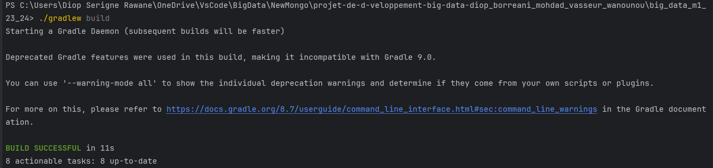

4. Lancer les conteneurs Docker pour MongoDB et Redis :
    ```bash
    docker-compose up -d
    ```
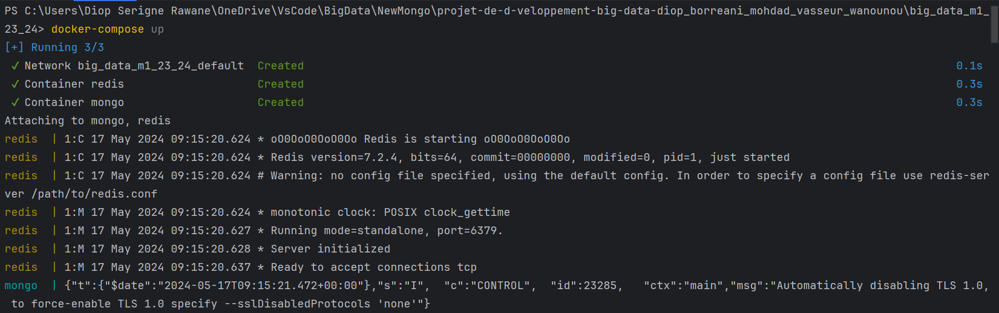
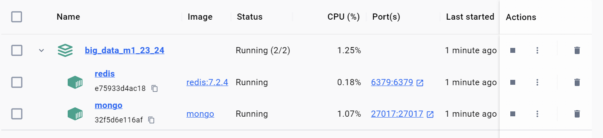
5. Lancer l'application Spring Boot :
    ```bash
    ./gradlew bootRun
    ```
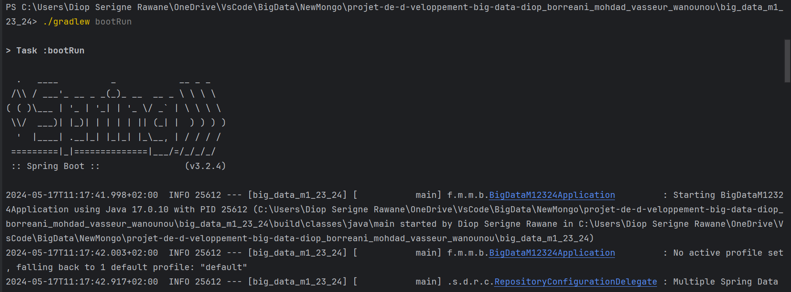
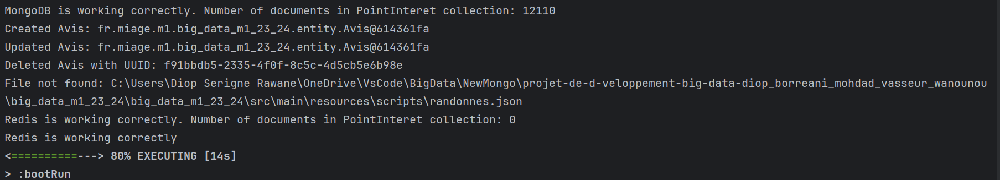


### Test de lancement

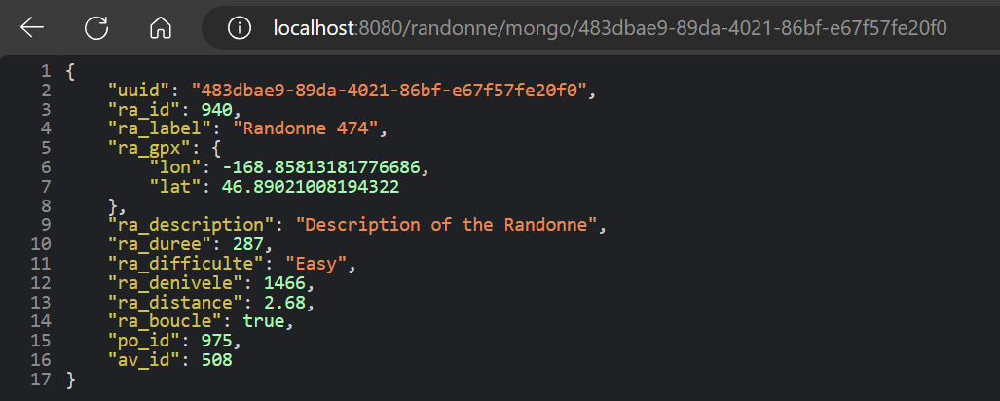

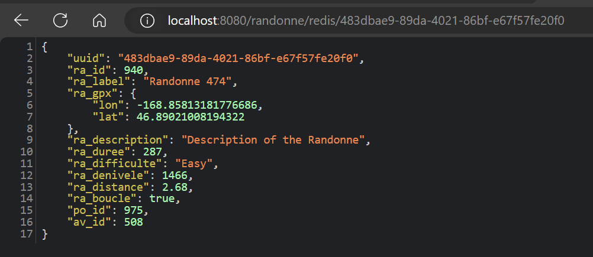

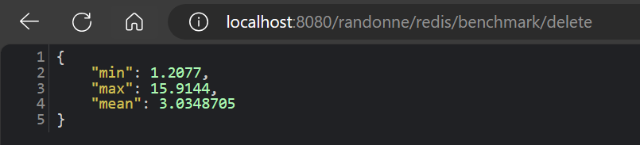

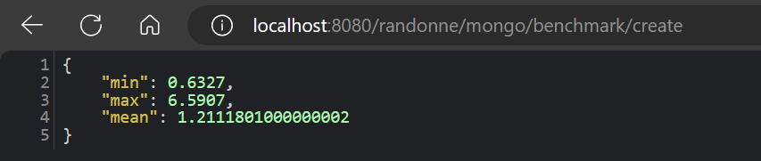

6. Lancer l'application Front :

    Naviguer dans le répertoire du front :
    ```bash
    cd projet-de-d-veloppement-big-data-diop_borreani_mohdad_vasseur_wanounou\front
    ```

    ```bash
    Ouvrez le fichier index.html avec Live Server ou lancez le en Line de commande.
    ```
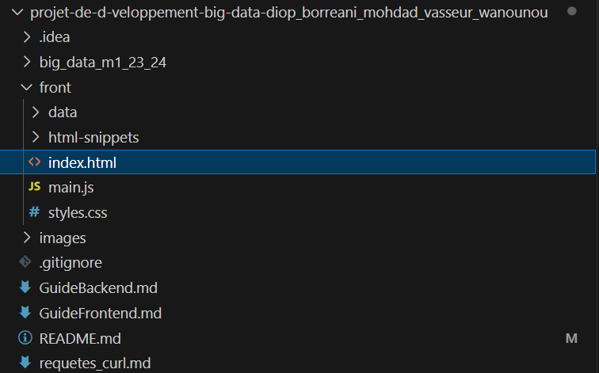

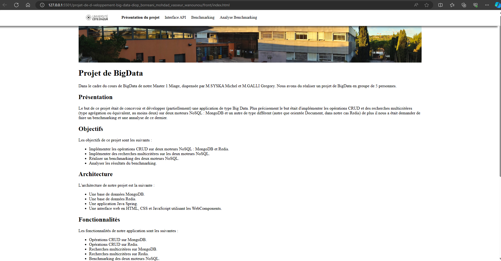

6. Lancer l'application Front :
Comme notre front a été déployé sur un serveur, vous avez aussi l'option de le lancer directement en utilisant ce URL :

**URL Frontend** : [`http://borreani.fr/projet-de-d-veloppement-big-data-diop_borreani_mohdad_vasseur_wanounou/front/#`](http://borreani.fr/projet-de-d-veloppement-big-data-diop_borreani_mohdad_vasseur_wanounou/front/#)

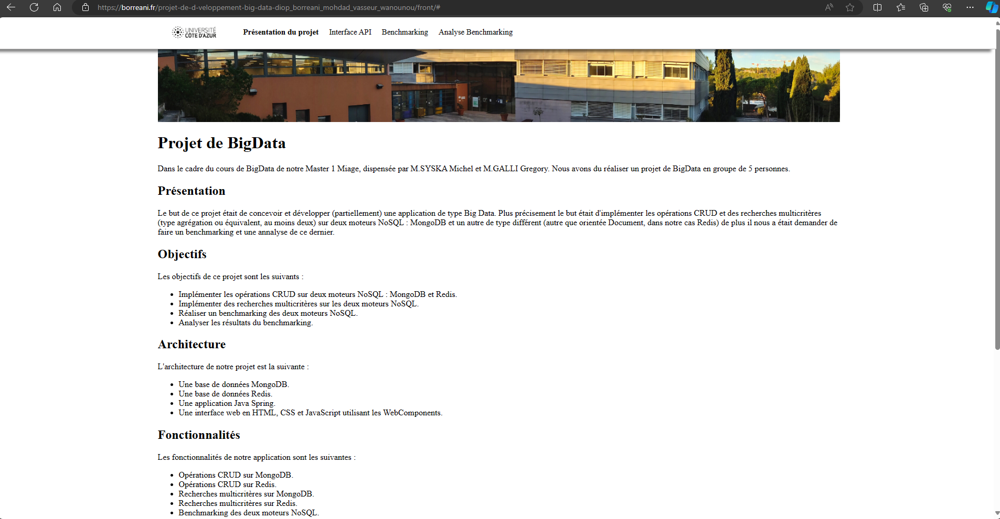


### Premiers pas 

Avant de lancer l'application, il faut configurer les instances mongo et redis dans IntelliJ.

Pour ce faire :

#### Configuration de MongoDB dans IntelliJ

1. Dans IntelliJ IDEA, accédez à > **Database**.
2. Cliquez sur l'icône **+** pour ajouter une nouvelle configuration de base de données et allez dans **Data Source**.
3. Sélectionnez **MongoDB**.
4. Dans la fenêtre de configuration, donner le nom **randonnees** et laissez tous les autres paramètres par défaut.
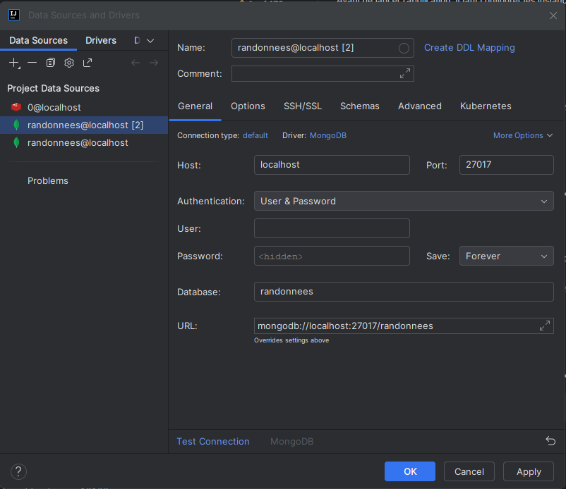
5. Cliquez sur **Test Connection** pour vérifier la connexion, puis sur **OK** pour enregistrer la configuration.


#### Configuration de Redis dans IntelliJ

1. Dans IntelliJ IDEA, accédez à > **Database**.
2. Cliquez sur l'icône **+** pour ajouter une nouvelle configuration de base de données et allez dans **Data Source**.
3. Sélectionnez **Redis**.
4. Dans la fenêtre de configuration et laissez tous les autres paramètres par défaut.
5. Cliquez sur **Test Connection** pour vérifier la connexion, puis sur **OK** pour enregistrer la configuration.

### Configuration 

Si l'application met trop de temps à charger les données et que vous souhaitiez tester sans pour autant avoir autant de données.

Veuillez ouvrir le fichier ```BigDataM12324Application``` dans ```big_data_m1_23_24/src/main/java``` et modifiez les fichiers à charger sur les deux BDD en enlevant **100000Donnees** à la fin des 3 fichiers à charger à savoir **randonnes**, **avis** et **point_interets**. 
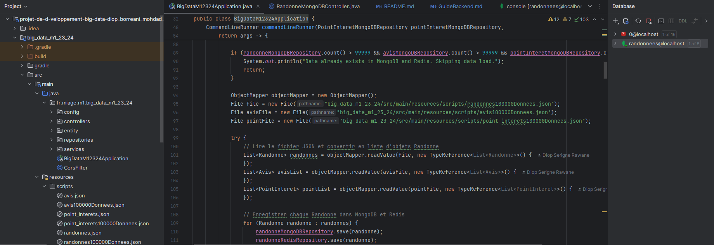  
Ainsi, vous allez charger 1 000 données au lieu de 100 000 dans chacune des 3 tables. Ceci, ne bloque en rien l'application, vous aurez quand même toujours des itérations sur **10 000**, **20 000**, **50 000**, **100 000**, **250 000**, **500 000** et **1 000 000** de données à tester pour la performance sur le benchmark.


### L'application

Une fois l'application lancée, elle effectue les actions suivantes :

1. **Initialisation et vérification des connexions** :
    - Vérifie que Redis fonctionne correctement en enregistrant et en récupérant une clé simple.
    - Vérifie que MongoDB fonctionne correctement en comptant le nombre de documents dans la collection `PointInteret`.

2. **Chargement des données initiales** :
    - Charge les 1000 données à partir de fichiers JSON (`randonnes.json`, `avis.json`, `point_interets.json`) générées à partir d'un script ```python``` et les enregistre dans les bases de données MongoDB et Redis.

3. **Tests des opérations CRUD via l'API REST** :
    - Teste la création, la mise à jour et la suppression d'entrées dans MongoDB et Redis en utilisant des requêtes HTTP via `RestTemplate`.
    - Les tests incluent des opérations sur les entités `Randonne` et `Avis`.

### Détails des actions

#### 1. Initialisation et vérification des connexions

- **Redis** :
    - Enregistre une valeur avec une clé spécifique et récupère cette valeur pour vérifier que Redis fonctionne correctement.
    - Affiche un message indiquant si Redis fonctionne correctement ou non.

- **MongoDB** :
    - Compte le nombre de documents dans la collection `PointInteret` pour vérifier que MongoDB fonctionne correctement.
    - Affiche un message indiquant si MongoDB fonctionne correctement ou non.

#### 2. Chargement des données initiales

- Utilise `ObjectMapper` pour lire les fichiers JSON et convertir les données en objets Java.
- Enregistre les objets `Randonne`, `Avis` et `PointInteret` dans MongoDB et Redis.

#### 3. Tests des opérations CRUD via l'API REST

- **Création** :
    - Crée une nouvelle instance de `Randonne` ou `Avis` et l'enregistre dans la base de données via une requête POST.

- **Mise à jour** :
    - Met à jour les champs d'une instance existante de `Randonne` ou `Avis` et envoie une requête PUT pour enregistrer les modifications.

- **Suppression** :
    - Supprime une instance spécifique de `Randonne` ou `Avis` via une requête DELETE.


## Architecture du Projet

Le ```src``` du projet est organisé de la manière suivante :

```plaintext
big_data_m1_23_24/
├── src/
│   ├── main/
│   │   ├── java/
│   │   │   └── fr/
│   │   │       └── miage/
│   │   │           └── m1/
│   │   │               └── big_data_m1_23_24/
│   │   │                   ├── config/
│   │   │                   ├── controllers/
│   │   │                   ├── entity/
│   │   │                   ├── repositories/
│   │   │                   ├── services/
│   │   │                   ├── BigDataM12324Application.java
│   │   │                   └── CorsFilter.java
│   ├── resources/
│   │   │   ├── scripts/
│   │   │   │   ├── avis.json
│   │   │   │   ├── point_interets.json
│   │   │   │   └── randonnées.json
│   │   │   └── application.properties
│   └── test/
```

## Contributeurs

- M. MOHDAD Ralph
- M. VASSEUR Matthéo
- M. WANOUNOU Ilan
- M. DIOP Serigne Rawane
- M. BORREANI Théo

## Utiles
Pour plus de détails, consultez le [Guide Backend](GuideBackend.md).    

Pour plus de détails, consultez le [Guide Frontend](GuideFrontend.md).

Pour notre **frontend**, consultez le lien suivant : [`http://borreani.fr/projet-de-d-veloppement-big-data-diop_borreani_mohdad_vasseur_wanounou/front/#`](http://borreani.fr/projet-de-d-veloppement-big-data-diop_borreani_mohdad_vasseur_wanounou/front/#)

Veuillez bien lancer l'application Spring côté backend avant de tester le front, sans quoi vous n'aurez pas de retour sur les requêtes.


## Remarques

### Structure de MongoDB

Dans MongoDB, les données sont organisées en collections au sein d'une base de données. Voici la structure utilisée pour ce projet :

- **Base de données : `randonnees`**
    - **Collection : `avis`**
        - Contient les documents des avis des utilisateurs sur les randonnées.
    - **Collection : `pointInteret`**
        - Contient les documents des points d'intérêt associés aux randonnées.
    - **Collection : `randonne`**
        - Contient les documents des randonnées avec leurs détails respectifs.

Chaque document dans les collections MongoDB est stocké au format JSON et peut contenir des sous-documents et des tableaux pour représenter les relations hiérarchiques.

### Structure de Redis

Dans Redis, les données sont stockées sous forme de clés et de types de valeurs spécifiques. Voici la structure utilisée pour ce projet :

- **Base de données : `0` (par défaut)**
    - **Dossier : `strings`**
        - Contient des paires clé-valeur simples.
    - **Dossier : `sets`**
        - Contient des ensembles de valeurs uniques.
    - **Dossier : `hash tables`**
        - Contient des tables de hachage pour stocker des objets complexes sous forme de paires clé-valeur.

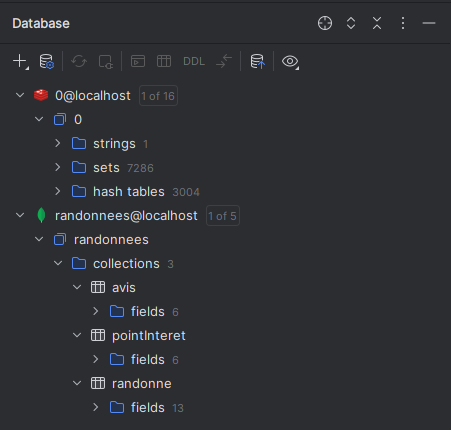
### Comparaison des formats

- **MongoDB** :
    - Les données sont stockées sous forme de documents JSON, ce qui permet une structure flexible et hiérarchique.
    - Chaque collection regroupe des documents de type similaire, facilitant les opérations de requête et de manipulation de données complexes.

- **Redis** :
    - Les données sont principalement stockées en mémoire, ce qui permet un accès très rapide.
    - Les types de données Redis (strings, sets, hash tables) sont utilisés pour optimiser les performances en fonction de l'utilisation spécifique.
    - Redis offre une structure plus simple mais moins flexible que MongoDB pour les relations hiérarchiques complexes.

### Conclusion

- **MongoDB** est plus adapté pour les données complexes et les relations hiérarchiques grâce à son format de document JSON.
- **Redis** est plus performant pour les accès rapides et les opérations fréquentes sur des ensembles de données simples grâce à son stockage en mémoire et à ses types de données optimisés.

Ces différences influencent les choix d'implémentation et les performances des opérations CRUD et des recherches multicritères dans l'application.

### Choix d'une seule collection au lieu de plusieurs

Dans notre projet, nous avons choisi d'utiliser une seule collection par type de données (avis, pointInteret, randonne) dans MongoDB et Redis plutôt que de multiples collections. Voici quelques raisons expliquant ce choix :

1. **Simplicité de la gestion des données** :
    - Utiliser une seule collection pour chaque type de données simplifie la gestion et la maintenance des données. Cela permet de centraliser les opérations CRUD et les recherches multicritères, rendant le code plus lisible et plus facile à maintenir.

2. **Performance des requêtes** :
    - Avoir toutes les données d'un même type dans une seule collection améliore les performances des requêtes. Les opérations de recherche et d'agrégation peuvent être optimisées en tirant parti des index et des capacités de traitement des collections.

3. **Modélisation des données** :
    - Utiliser une seule collection pour chaque type de données correspond mieux à la modélisation orientée documents de MongoDB et à la structure en mémoire de Redis. Cela permet de conserver une structure de données cohérente et d'exploiter pleinement les avantages de ces bases de données NoSQL.

4. **Scalabilité** :
    - Une seule collection par type de données facilite la scalabilité horizontale. Il est plus facile de répartir les données sur plusieurs instances ou clusters lorsque la structure de données est unifiée.

En résumé, l'utilisation d'une seule collection par type de données dans MongoDB et Redis simplifie la gestion des données, améliore les performances des requêtes, et permet une meilleure scalabilité. Ce choix nous permet également de tirer pleinement parti des capacités des bases de données NoSQL utilisées dans ce projet.

  